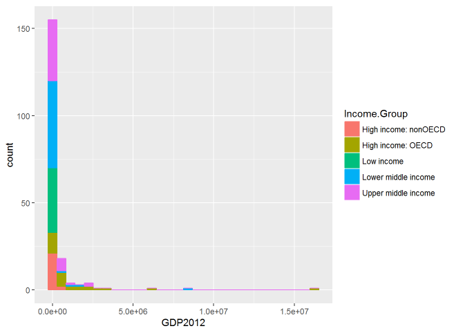

###Overview

The following case study provides descriptive statistics concerning World Gross Domestic Product based on data collected by the World Bank in order to answer the following questions:

1. How many Country Code ID's match between the two datasets?
2. What is the 13th country in descending order by GDP?
3. What are the average GDP rankings for the "High income: OECD" and "High income: nonOECD" groupgs.
4. Plot the GDP for all countries and color code the results by Income Group
5. Cut tthe GDP for all countries into 5 separate quantile groups.  Make a table versus Income Group.  How many countries are "Lower middle income" but among the 38 nations with the highest GDP?

The data sets used in this study can be found at the following links:

* [GDP Rankings](http://data.worldbank.org/data-catalog/GDP-ranking-table)
* [Educational Statistics](http://data.worldbank.org/data-catalog/ed-stats)

R Packages used:

* downloader
* ggplot2
* dplyr
* data.table


___

```{r setup, include=FALSE}
knitr::opts_chunk$set(echo = TRUE)
```

```{r}
library(downloader)
library(ggplot2)
library(dplyr)
library(data.table)
```

###Loading Data

The following code downloads the files and reads them into R as dataframes.  The GDP Ranking data includes a header, and footer.  The header was removed by skipping the first 5 lines of the file as it was read in.  The footer is taken care of later in the Data Cleaning section.

```{r}
download("https://d396qusza40orc.cloudfront.net/getdata%2Fdata%2FGDP.csv", destfile="GDP.csv")
download("https://d396qusza40orc.cloudfront.net/getdata%2Fdata%2FEDSTATS_Country.csv", destfile="Education.csv")
GDP <- read.csv("GDP.csv", stringsAsFactors = FALSE, header = FALSE, skip = 5)
Education <- read.csv("Education.csv", stringsAsFactors = TRUE, header = TRUE)
```

___

###Cleaning Data
In order to answer the questions concerning World GDP, the datasets needed to be merged, cleaned, and tidied.  The GDP dataframe in particular contained extraneous information and poor formating of columns that needed to be fixed.  The merged file also required the transformation of some character datatypes to numerics before they could be analyzed.  The rest of this section details the steps taken along with the precise code used to clean the data.  This section can be skipped over by readers only interested in the analysis and summary but has been included to ensure reproducibility.

The Counts() function uses the functions naCount() and nullCount() to read a dataframe and return the number of NA and Null values.  These functions will be used later to verify the cleaned merged data frame.

```{r}
#this function reads in a dataframe and returns a vector of the number of NA's for each column
naCount <- function(df) {
  counts <- vector()
  for (name in names(df)) {
    counts<-append(counts, sapply(df[name], function(x) sum(length(which(is.na(x)))))) #sums number of Nas for each column
  }
  return(counts)
}
#this function reads in a dataframe and returns a vector of the number of Null's for each column
nullCount <- function(df) {
  counts <- vector()
  for (name in names(df)) {
    counts<-append(counts,sapply(df[name], function(x) sum(length(which(is.null(x)))))) #sums number of nulls for each column
  }
  return(counts)
}
#this function reads in a dataframe and calls the naCount() and nullCount() functions and returns a dataframe of total counts
Counts <- function(df) {
  naCounts <- naCount(df)
  nullCounts<- nullCount(df)
  return(data.frame(naCounts, nullCounts))
}
```

To remove a blank column, the footer, and some haphazardly named column names, the GDP dataframe was subsetted by rows 1 through 190 and columns 1, 2, 4, and 5.  The GDP dataframe was also given descriptive column names.

```{r}
GDP <- GDP[1:190, c(1,2,4,5)] #slices out only the data we are interested in
colnames(GDP)<-c("CountryCode", "Ranking", "Short.Name", "GDP2012") #applies discreptive column names
```

The dataframes Education and GDP were then merged.  Since, the only column of data we need from Education for this case study is Income.Group located at column index 6, the merged dataframe was subsetted by columns 1, 2, 3, 4, 5, 6.  The merge() function option "all"" is set to FALSE in order to limit the data frame to complete rows only.

```{r}
GDP_Education<-merge(GDP, Education, by="CountryCode", all=FALSE) #set all to false to limit only complete rows of data
GDP_Education<-GDP_Education[,1:6]

```

The structure of the merged dataframe consists of character and factor datatypes; however, "Ranking" and "GDP2012" need to be converted to numeric values in order to be analyzed.

```{r}
str(GDP_Education)
```

This answers Question 1 - there are 189 IDs that match between the two dataframes.  The following code converts Ranking and GDP2012 from characters to numeric.  Data cleaning was confirmed with str() and Counts() functions to ensure data type conversion and the absence of NA and Null values.

```{r}
GDP_Education$Ranking <- as.numeric(GDP_Education$Ranking)
GDP_Education$GDP2012 <- as.numeric(gsub("," ,"", GDP_Education$GDP2012)) #removes comma and converts to numeric
str(GDP_Education)
Counts(GDP_Education) #calls custom function to count number of NAs and Nulls in the dataframe
```

___

###Answering Questions about World GDP
The merged data frame is now ready to answer questions 2-4.  The following code orders the data frame from lowest to highest GDP.

```{r}
GDP_Education <- GDP_Education[order(GDP_Education[,"GDP2012"], decreasing=FALSE),] #decreasing to false to order from lowest to greatest
GDP_Education[13,] #return 13th row to answer question 2.
```

Question 2 - the 13th country by descending GDP is St. Kitts and Nevis.

```{r}
avg_high_OECD <- mean(GDP_Education$Ranking[GDP_Education$Income.Group == "High income: OECD"])
avg_high_non <- mean(GDP_Education$Ranking[GDP_Education$Income.Group == "High income: nonOECD"])
avg_high_OECD
avg_high_non
```

Question 3 - The average GDP ranking for the "High income: OECD" is 32.97 and the average ranking for "High income: nonOECD" is 91.91.

The plot that answers Question 4 of the GDP for all countries color coded by Income Group:

```{r fig.show='hide'}
qplot(GDP2012, data=GDP_Education, fill=Income.Group, color=Income.Group, bins=30)
```



The plot shows that High Income OECD countries tend to have the highest GNPs and that their difference from other countries is very large.  Surprisingly, there are a few Lower Middle Income countries whose GNPs outperform High Income countries.  Lastly, the importance of OECD membership can be seen in the placement of High Income non-OECD countries in the lowest two bins of the plot versus OECD member countries that generally outperform the rest of the world.

To answer Question 5 the data frame is divided into pentiles (five equally-sized groups).  The dplyr packages mutate() and ntile() functions allow one to add a new column of n-tile classifications to a dataframe.  Since there are an odd number of observations in the data frame we have to use the dplyr desc() function to change the order of the data frame to ensure that the first pentile inludes the top 38 countries by GDP.

```{r}
GDP_Education_Pentile<-GDP_Education %>% mutate (pentile = ntile(desc(GDP_Education$GDP2012), 5))
GDP_Education_Pentile[GDP_Education_Pentile$pentile == 1 & GDP_Education_Pentile$Income.Group == "Lower middle income",] #selects 1st pentile (top 38 GDP countries) from the Lower Middle Income group
```

Therefore, there are 5 countries from the Lower Middle Income group in the first pentile (top 38 GPDs).  A table of pentiles (x) versus Income Group (y) follows: 

```{r}
Pentile_Table<-data.table(x=GDP_Education_Pentile$pentile, y=GDP_Education_Pentile$Income.Group)
print(Pentile_Table, nrows = 189) #have to specify number of rows to display more than first and last 5.
```

___

###Summary

In summary, a country's Income Group does not necessarily translate to a specific GDP.  The various Income Groups can be seen across nearly all the pentiles with the exception of no High Income: OECD countries in the 5th quantile and no Low Income in the 1st.  Generally speaking, a country's membership in OECD is a better indicator of higher GDP with OECD countries falling mainly in the top 3 pentiles, average ranking 32.97, with the exception of one OECD member in the 4th.  Conversely, non-OECD High Income countries have an averge ranking of just 91.91.  Last, the top pentile has significantly higher GDP's than the subsequent four indicating that the world's wealth is unevenly distributed.


____
____